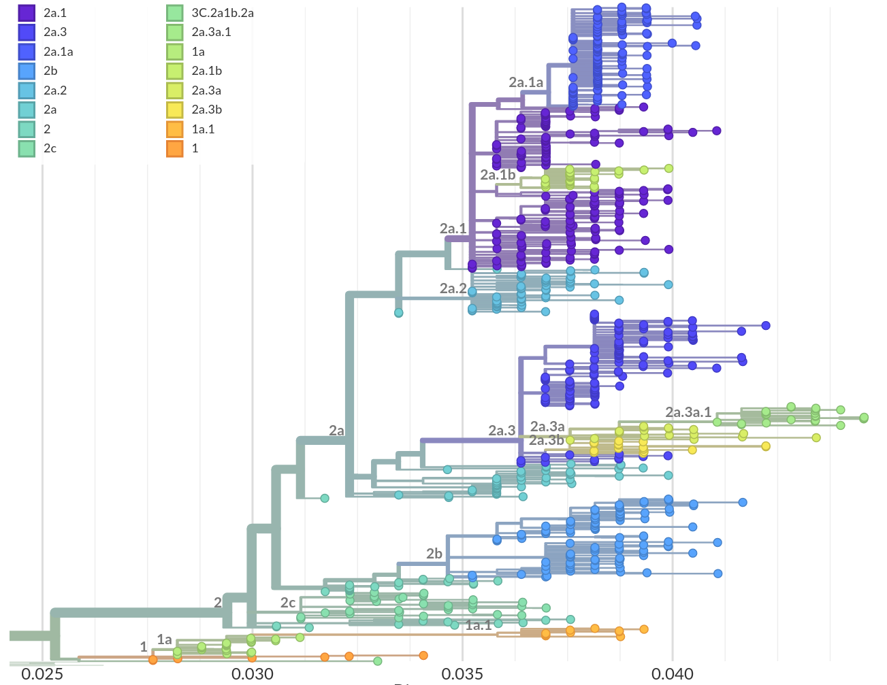

# 2023-01-24: Overview of updated clades

## H3N2

The recent clade update splits the previous 3C.2a1b.2a.1 and 3C.2a1b.2a.2 into a number of subclades.
To shorten the clade labels, the prefix 3C.2a1b.2a will be dropped in much of the discussion as no viruses outside this group have been observed in a while.
The current breakdown is meant to capture the dynamics of currently circulating phylogenetic distinct subclades.

### Subclades

 * **Clade 1**
    * additional mutations: G186S, S198P
    * vaccine strain: A/Tasmania/503/2020
    * **Clade 1a**
        * additional mutations: K171N
        * vaccine strain: A/Cambodia/e0826360/2020
        * **Clade 1a.1**
            * additional mutations: I48T
            * comment: almost exclusively in China

 * **Clade 2**
    * additional mutations: Y159N, T160I, L164Q, G186D, D190N
    * comment: descendants dominate outside of China

    * **Clade 2a**
        * additional mutations: H156S, diversity at 53[N/G]
        * vaccine strain: A/Darwin/6/2021
        * **Clade 2a.1**:
            * additional mutations: D53G, D104G, K276R
            * **Clade 2a.1a**
                * additional mutations: L157I, K220R
            * **Clade 2a.1b**
                * additional mutations: I140K, R299K
        * **Clade 2a.2**:
            * additional mutations: D53G, R201L, S219Y
        * **Clade 2a.3**:
            * additional mutations: D53N, N96S, I192F
            * **Clade 2a.3a**:
                * additional mutations: E50K
            * **Clade 2a.3a**:
                * additional mutations: I140M
    * **Clade 2b**:
        * additional mutations: E50K, F79V, I140K
        * comment: has grown recently, 140K and 50K
    * **Clade 2c**:
        * additional mutations: S205F, A212T
        * comment: mostly extinct
    * **Clade 2d**:
        * additional mutations: G62R, H156Q, S199P
        * comment: mostly extinct

